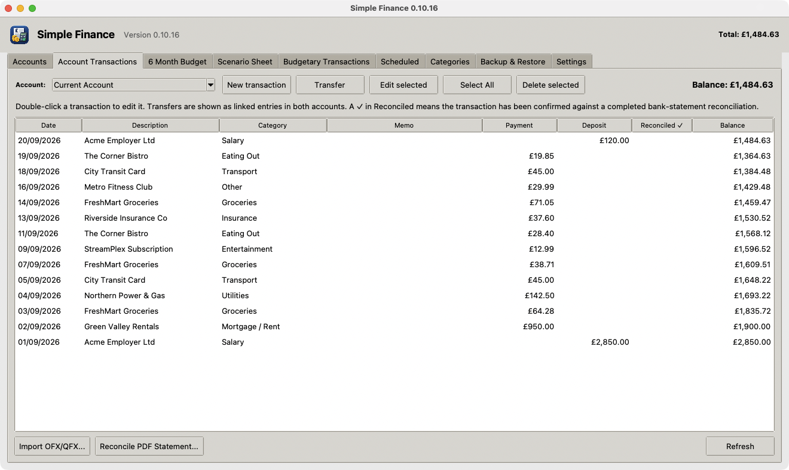

# Simple Finance

A lightweight, Moneydance-style personal finance app: accounts, transactions,
budgeting, bank statement reconciliation (OFX + PDF), and a six-month forecast
with scenario planning. Built on Python's standard library (Tkinter + SQLite) —
no third-party runtime dependencies.

This is the migrated, actively-developed successor to the original
`SimpleFinance` prototype. Existing Linux installs keep working unchanged: the
app data directory is still `~/.local/share/simple-finance` on Linux (and now
also has proper per-OS locations on Windows/macOS).



## Download

Get the latest installer and the PDF user manual from the
**[Releases page](https://github.com/mikehellyer/simple-finance/releases/latest)**:

- **Windows**: `SimpleFinance-Setup.exe`
- **macOS**: `SimpleFinance-<version>.dmg`
- **Linux**: `simplefinance_<version>_amd64.deb`
- **User Manual**: `Simple-Finance-User-Manual.pdf`

Every release is built and published automatically by GitHub Actions when a
version is tagged - see [Releasing](#releasing) below.

## Project layout

```
src/simplefinance/
    app.py        the application (GUI + SQLite data layer)
    updater.py     GitHub-release update checker (no Tkinter dependency, unit-tested)
    paths.py       cross-platform per-user data directory
    version.py     __version__ and the GitHub repo the update checker polls
    __main__.py    entry point (`python -m simplefinance`)
tests/             pytest suite (currently: updater.py)
packaging/         PyInstaller spec + per-OS installer build scripts
docs/              build_manual.py generates the PDF user manual; images/
                    holds README assets (not release artifacts)
.github/workflows/ CI: test on every push/PR, build installers + publish a
                    GitHub Release when a v*.*.* tag is pushed
```

The app itself is still one large module (`app.py`, ported close to as-is from
the original `simple_finance.py`). Splitting it into smaller modules is a
reasonable next step, but wasn't done in this migration to avoid introducing
regressions in a 10k-line file with no prior test coverage.

## Local development

```bash
python3 -m venv .venv
source .venv/bin/activate        # Windows: .venv\Scripts\activate
pip install -r requirements-dev.txt
PYTHONPATH=src python -m simplefinance
```

Run the tests:

```bash
pytest
```

## Update checker

On startup, the app makes one background, non-blocking request to
`GET https://api.github.com/repos/<owner>/<repo>/releases/latest` (repo is set
in `src/simplefinance/version.py`) and compares the release tag to
`__version__`. If GitHub is unreachable, there are no releases yet, or the
running version is current, nothing happens — the check fails silently.

If a newer version is published, a banner appears above the tab bar with the
new version number and two buttons: **Update** and **Dismiss**. Nothing is
downloaded automatically. Clicking **Update** downloads the release asset that
matches the current OS (`.exe` / `.dmg` / `.deb`) and hands off to the OS's
normal "open this file" action — the user completes the actual install/reinstall
step themselves.

## Packaging

Each OS installer is built from a PyInstaller onedir build:

```bash
pip install -r requirements-dev.txt
pyinstaller packaging/pyinstaller/simplefinance.spec
```

Then, per OS:

- **Windows**: `python packaging/windows/make_icon.py` (builds `icon.ico`),
  then compile `packaging/windows/installer.iss` with Inno Setup
  (`iscc /DAppVersion=1.2.3 packaging\windows\installer.iss`) to get
  `SimpleFinance-Setup.exe`.
- **macOS**: `./packaging/macos/make_icon.sh` (builds `icon.icns`), then
  `./packaging/macos/build_dmg.sh 1.2.3` (needs `brew install create-dmg`) to
  get `SimpleFinance-1.2.3.dmg`.
- **Linux**: `./packaging/linux/build_deb.sh 1.2.3` to get
  `simplefinance_1.2.3_amd64.deb` (adds a menu entry + icon via
  `packaging/linux/simple-finance.desktop`).

In practice you won't run these by hand — pushing a tag does it for you (next
section).

## Releasing

1. Bump `__version__` in `src/simplefinance/version.py`.
2. Commit, then tag and push:

   ```bash
   git tag v1.2.3
   git push origin main v1.2.3
   ```

3. GitHub Actions builds all three installers and publishes them to a GitHub
   Release on the tag. Running copies of the app will offer that release as an
   update on their next startup check.
